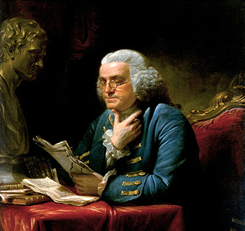

The Keystone Digital Humanities Conference was hels in the Kislak Center for Special Collections, Rare Books and Manuscripts at the University of Pennsylvania Libraries, July 22-24, 2015.

**Registration is closed. See you next year!**

We are thrilled to announce that Dr. Miriam Posner, Coordinator and Core Faculty of the Digital Humanities Program at UCLA, will be presenting the keynote lecture, *“What's Next?: The Radical, Unrealized Potential of Digital Humanities.”*

The program will consist of long presentations (20 minutes), short presentations (7 minutes), project showcases (10 minutes) and workshops (various lengths) in all areas of digital humanities. Presentations may take

Ben Franklin
the form of interactive presentations, short papers, project demos, panel discussions or workshops. Presenters will include emerging and veteranstudents, teachers, and scholars.

On Twitter? Follow the Keystone DH hashtag [#keydh](https://twitter.com/search?f=tweets&vertical=default&q=%23keydh&src=typd)

The [Association for Computers and the Humanities](http://ach.org/) is covering registration for ten graduate students to present at the conference.

### Conference Organizing Committee

- Dawn Childress, Penn State University
- William Noel, University of Pennsylvania
- Molly Des Jardin, University of Pennsylvania
- James O'Sullivan, Penn State University
- Mitch Fraas, University of Pennsylvania
- Dot Porter, University of Pennsylvania
- Patricia Hswe, Penn State University
- Katie Rawson, University of Pennsylvania
- Diane Jakacki, Bucknell University
- Matt Shoemaker, Temple University
- David McKnight, University of Pennsylvania
- Stefan Sinclair, McGill University
- Dennis Mullen, University of Pennsylvania
- Rebecca Stuhr, University of Pennsylvania